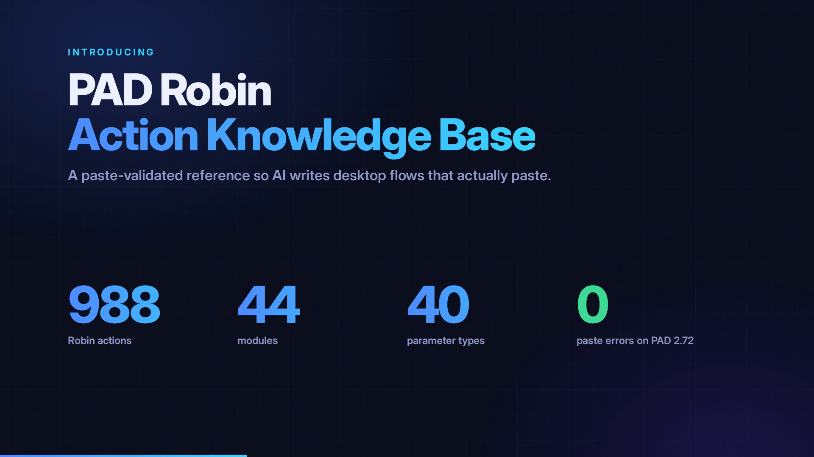

# PAD Robin Action Knowledge Base

A paste-validated reference for the Robin scripting language behind Power Automate Desktop (PAD), built so AI assistants can write desktop flows that actually paste.

There is no official Robin reference. The original language site went offline in 2021, the Designer is the only thing that knows the syntax, and every action has selector variants with different argument sets that the Designer never shows you in text form. Ask a model to write Robin from its training data and you get scripts that PAD silently rejects: paste them, and the canvas stays empty.

This repo is the missing reference.

[](marketing/video/pad-robin-kb-promo.mp4)

## What is in it

| File | Contents |
|---|---|
| `PAD_Robin_ActionKB_v3_1.json` | 988 Robin actions across 45 modules. Every record has a template, a golden example that pasted into PAD Designer with zero errors, typed input and output parameters, and the other selector forms of the same action. |
| `PAD_Robin_TypeReference_v3_1.json` | 44 parameter types with the exact syntax PAD accepts for each: strings, numbers, file paths, handle variables, lists, UI selectors, and the rule for enums. |
| `PROMPT.md` | A system prompt that turns a model into a template filler over these two files. This is how the data is meant to be used. |

Validated against PAD 2.72 (build 2.72.00183.26250), September 2026: all 988 golden examples were re-pasted exactly as published into the 2.72 Designer, with zero errors. The syntax rules below were probed on the same build in October 2026 with 563 test pastes, including 19 complex flows of up to 97 rows.

## The two-table idea

Do not ask the model to write Robin. Ask it to pick an action from the KB, copy the golden example, and change the values, using the Type Reference to format each value. The model does lookup and substitution, not code generation. In practice this took a pipeline from roughly one working script in five to scripts that paste clean on the first try, including 30-action compositions with loops and conditions.

## Fields

```json
{
  "actionId": "Text.JoinText.JoinWithDelimiter",
  "module": "Text",
  "kind": "Action",
  "selector": "JoinWithDelimiter",
  "template": "Text.JoinText.JoinWithDelimiter List: `` StandardDelimiter: Text.StandardDelimiter.Space DelimiterTimes: 1 Result=> JoinedText",
  "golden_example": "Text.JoinText.JoinWithDelimiter List: List StandardDelimiter: Text.StandardDelimiter.Space DelimiterTimes: 1 Result=> JoinedText",
  "input_params": [ { "name": "List", "type": "List`1<String>", "required": true }, ... ],
  "output_params": [ { "name": "Result", "type": "String", "defaultVariable": "JoinedText" } ],
  "constraints": { "DelimiterType": "Standard" },
  "sibling_selectors": [ "Text.JoinText.Join", "Text.JoinText.JoinWithCustomDelimiter" ],
  "needs_ui_selector": false,
  "validation": "paste-validated 2026-09 (PAD 2.72) ..."
}
```

- **actionId** is the Robin id: `Module.Action` or `Module.Action.Selector`.
- **kind** tells you the wrapper. `Condition` records are written `IF (...) THEN` and need an `END`; `Wait` records are `WAIT (...)`; `While` records are `LOOP WHILE (...)` with an `END`.
- **template** has empty backticks where you must supply a value. **golden_example** is the same line with placeholder values, and it pasted into the Designer without a single error.
- **input_params** names are the Robin argument names. Some differ from PAD's internal property names, for example `Element` rather than `Control`, so always use these.
- **sibling_selectors** is the field that matters most for non-trivial scripts. `Text.JoinText.Join` takes only a list. If you need a delimiter, the argument does not exist on that form; it lives on `JoinWithDelimiter`. Adding an argument from one form to another gives "Unknown argument". Inventing a selector name gives an empty canvas.
- **constraints** are the properties a selector fixes, which is why they are absent from its arguments.
- **needs_ui_selector** marks 17 records whose input is a recorded UI element, web element, or image. Their examples use a placeholder and will not run as written; the shape is still correct.

## Syntax rules PAD enforces

Every rule below was confirmed by pasting into PAD 2.72 (2.72.00183.26250): 563 probe pastes in October 2026. Most failures are silent. PAD drops the whole paste, the canvas stays empty and no error is shown, so one bad line costs the whole script.

**Values**

1. Strings are `$'''value'''`. Booleans are bare `True` / `False`. Numbers are bare.
2. A variable from an earlier action is referenced by its bare name (`Instance: ExcelInstance`). Expressions are bare too: `SET Total TO Price * Qty`, `IF Files.Count = 0 THEN`, `WAIT Attempt * 10`, `Items[Items.Count - 1]`, `Row['Amount']`.
3. `%...%` belongs only inside strings: `$'''Saved %Count% files'''`, `$'''Total %Price * Qty%'''`. Anywhere else it rejects the whole paste, for example `SET X TO %N + 1%`, `IF %N% = 5` or `Text: %Msg%`.
4. Enums are fully qualified, `Module.EnumType.Value`, and the module is the one that owns the type (`Text.StandardDelimiter.NewLine`).
5. Outputs are `Name=> Variable`.

**Inside strings**

6. The backslash is an escape character: `\'` is an apostrophe and `\\` is one backslash.
   - Escape every apostrophe: `$'''Joe\'s report'''`, `$'''WHERE Name = \'Joe\''''`. A bare `'` rejects the paste. It is easy to miss in SQL, XPath and JavaScript.
   - Double a backslash that comes right before a variable or before the closing quotes: `$'''C:\Reports\\%Month%'''`, `$'''%Root%\\%Name%'''`, `$'''C:\Temp\\'''`. Before an ordinary letter a single backslash is kept as is (`$'''%Folder%\Report.xlsx'''`).
   - A UNC path needs four backslashes at the start, `$'''\\\\server\share'''`. Two become one without any error.
7. A literal percent sign is `%%`: `$'''100%% done'''`. A single `%` rejects the paste.
8. Strings may span several lines.

**Names**

9. PAD keywords can't be used as variable names or property names: `From`, `To`, `Step`, `End`, `In`, `Then`, `If`, `Else`, `Loop`, `Foreach`, `While`, `Set`, `Wait`, `Next`, `Exit`, `Label`, `Goto`, `Call`, `Case`, `Default`, `Switch`, `Block`, `Error`, `On`, `Not`, `And`, `Or`, `Mod`, `True`, `False`, `Global`, `Disable`, `Function`, `Throw`. Mail properties are the usual trap: write `Mail['From']` and `Mail['To']`, not `Mail.From`. Variable names can't start with a digit.

**Statements**

10. One statement per line. Built-in statements:
    - `SET x TO value`
    - `IF condition THEN` / `ELSE IF condition THEN` / `ELSE` / `END`
    - `SWITCH x` / `CASE = 1` / `CASE > 5` / `DEFAULT` / `END`
    - `LOOP FOREACH item IN list` / `END`
    - `LOOP i FROM 0 TO n - 1 STEP 1` / `END`
    - `LOOP WHILE (A) < (B)` / `END`
    - `EXIT LOOP`, `NEXT LOOP`, `LABEL Name` / `GOTO Name`, `WAIT 5`, `EXIT Code: 0`
11. Conditions use `=`, `<>`, `>`, `<`, `>=`, `<=`, `AND`, `OR` and `NOT(...)`, plus `IsEmpty(x)`, `IsNotEmpty(x)`, `Contains(x, $'''y''', False)`, `NotContains`, `StartsWith` and `EndsWith`. `CASE` takes a comparison only.
12. A condition action (kind `Condition`) is written `IF (Action ...) THEN`. `ELSE IF (Action ...) THEN` rejects the paste, so use `ELSE` with a nested `IF (Action ...) THEN ... END`.
13. Error handling for a group of actions, and for a single action:

    ```
    BLOCK ReadFiles
    ON BLOCK ERROR
        SET Failed TO True
    END
        ...actions...
    END

    Text.ToNumber Text: Raw Number=> Amount
    ON ERROR REPEAT 2 TIMES WAIT 5
        SET Amount TO 0
    END
    ```

    A handler may contain only `SET`, `CALL`, `GOTO` and `THROW ERROR`. Any other action gives "The statement isn't allowed inside exception handling", and an `IF` inside a handler rejects the whole paste. Set a flag in the handler and act on it after the block. `ERROR => LastError` reads the last error.
14. Comments are `# text` or `/# ... #/`. Regions are `**REGION Name` / `**ENDREGION`, and a `DISABLE ` prefix disables a line.
15. Don't paste the file header lines (`@@ConnectionString`, `IMPORT`, `@SENSITIVE`) or subflow definitions (`FUNCTION ... END FUNCTION`): both reject the paste. An `@@` metadata line must be followed directly by an action.
16. Semantic problems (unknown argument, undefined variable, wrong type, an enum without its module) land on the canvas with an error and a line number. PAD is lenient about the case of keywords, action ids and variable names, about argument order, and about spacing around `:` and `=>`.

The 3.1.3 documentation said property access in an `IF` condition rejects the paste. That was wrong: it does not reproduce, and the form that fails is `%...%` outside a string (rule 3).

`marketing/video/tools/check-flows.js` checks a script against these rules and the KB before you paste it:

```
node marketing/video/tools/check-flows.js PAD_Robin_ActionKB_v3_1.json flow.robin
```

On the 563 probe pastes it flagged all 108 silent rejects. It passed every clean paste except two that use `\%`, which PAD accepts but silently drops the percent sign.

## How it was validated

Every golden example was pasted into PAD Designer through UI automation and accepted with zero errors in the error pane. The March 2026 set (369 records) was additionally run through producer-to-consumer chains, so that, for example, an Excel action was validated with a real `ExcelInstance` from a launch action before it. The September 2026 sets were validated the same way in batches, with each action's error flag read back from the canvas individually: 578 records on PAD 2.67, and 46 records on PAD 2.72 (the new PowerPoint, PGP, LLM, Triggers and environment actions, plus records whose arguments changed in 2.72).

After each PAD update, the action ids and argument lists of every record are re-extracted from the module DLLs and compared. Records whose arguments changed are re-pasted on the new build, and records that no longer exist are removed (see CHANGELOG). Then every golden example in the release is re-pasted exactly as published on the new build. Each example gets the variables it references, such as an `ExcelInstance` or a `FileList`, from a validated producer action placed before it in the same paste. For PAD 2.72 that full re-paste was 988 examples in 83 batches with zero errors; each record's `validation` field records it.

Pasting proves the golden example, not the metadata around it. So before each release, every record is also checked against the PAD module DLLs: its argument and output names and types, the arguments its template and example use, and its selector, constraints and sibling forms. The Type Reference's producer actions get the same check. A release is not published unless that check has zero errors.

Validation means the Designer accepts the line. It does not mean the placeholder values make sense for your task; that is the model's job.

## What is not in this release

PAD 2.72 exposes 236 further selector variants that are not included here: 200 need a recorded UI element or image and cannot be validated from text, 25 need a live mail or work-queue connection to validate, and 11 are deprecated, removed, or unknown to the Designer. They may follow in a later release.

## Using it with an AI assistant

1. Give the model `PROMPT.md` as the system prompt.
2. Include the Type Reference, and the KB records for the modules your task needs (the full KB is about 3 MB; filter by `module`).
3. Ask for the flow. Run it through `marketing/video/tools/check-flows.js`, then paste the result into an empty flow in PAD Designer.
4. If the error pane lists anything, feed the messages back to the model with the same context.

## Maintenance

PAD updates add and change actions. The KB carries the PAD build it was validated against, and the intent is to re-validate after each Designer release. Issues and pull requests are welcome; a report of a record that fails to paste on a newer build is the most useful kind.

## License

The data files are released under Creative Commons Attribution 4.0 (CC BY 4.0). Use them for anything, including commercially, with attribution.

Built by Joe Green while automating Power Automate Desktop for real-world use.
